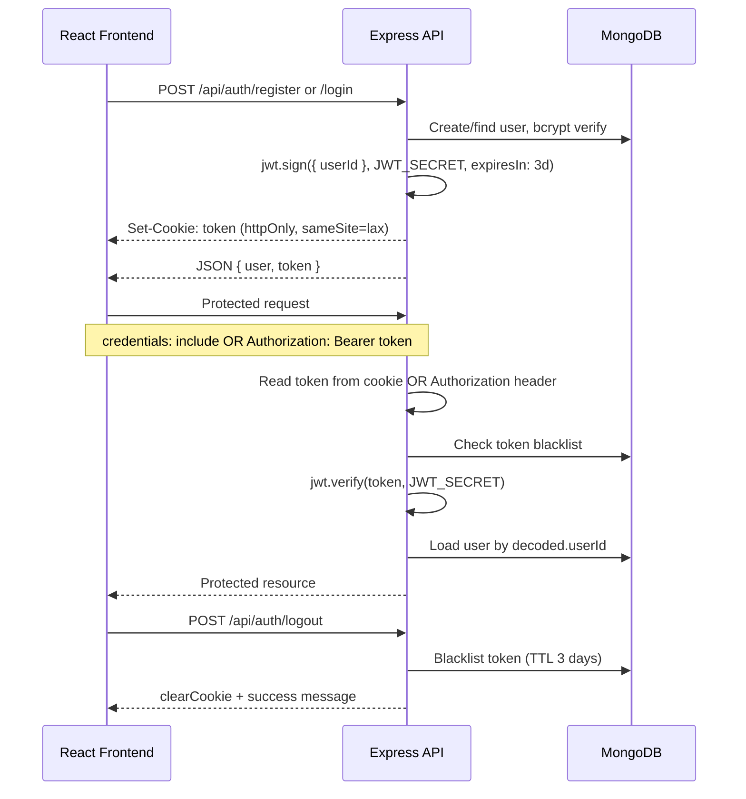

# Frontend Analysis — Bank Transaction System Backend

> Analysis of `BACKEND-LEDGER` for building a production-ready React frontend.  
> **No frontend code generated yet** — this document is the integration contract.

---

## Table of Contents

1. [API Map](#api-map)
2. [Request Schemas](#request-schemas)
3. [Response Schemas](#response-schemas)
4. [Authentication Flow](#authentication-flow)
5. [Protected Routes](#protected-routes)
6. [Account APIs](#account-apis)
7. [Transaction APIs](#transaction-apis)
8. [Transfer Money APIs](#transfer-money-apis)
9. [Environment Variables](#environment-variables)
10. [Route Map (Suggested Frontend)](#route-map-suggested-frontend)
11. [Frontend Integration Notes](#frontend-integration-notes)
12. [Potential Risks](#potential-risks)

---

## API Map

**Base URL:** `http://localhost:3000` (default `PORT`, overridable via env)  
**API prefix:** `/api`  
**Content-Type:** `application/json`  
**CORS:** Credentials enabled; origin must be listed in `FRONTEND_URLS`

| Method | Endpoint | Auth | Description |
|--------|----------|------|-------------|
| `GET` | `/` | Public | Health check — plain text: `"Ledger Service is up and running"` |
| `POST` | `/api/auth/register` | Public | Register a new user; returns JWT + sets cookie |
| `POST` | `/api/auth/login` | Public | Login; returns JWT + sets cookie |
| `POST` | `/api/auth/logout` | Public* | Logout; blacklists token + clears cookie |
| `GET` | `/api/auth/me` | **Protected** | Get authenticated user profile |
| `POST` | `/api/accounts` | **Protected** | Create a new bank account for logged-in user |
| `GET` | `/api/accounts` | **Protected** | List all accounts for logged-in user |
| `GET` | `/api/accounts/balance/:accountId` | **Protected** | Get balance for a specific owned account |
| `POST` | `/api/transactions` | **Protected** | Transfer money between accounts (user transfer) |
| `GET` | `/api/transactions` | **Protected** | List transactions for user's accounts |
| `POST` | `/api/transactions/system/initial-funds` | **System user** | Seed initial funds (admin/system only) |

\* Logout does not use auth middleware but reads token from cookie/header if present.

**Not implemented (gaps for frontend):**

- No `GET /api/auth/me` or profile endpoint
- No transaction history / list endpoint
- No account lookup by ID for recipients (only full account list for self)
- No password reset / email verification APIs
- No account status update (freeze/close) endpoints

---

## Request Schemas

### `POST /api/auth/register`

```json
{
  "email": "user@example.com",   // required, valid email, unique, lowercased
  "password": "string",          // required, min 6 characters
  "name": "string"               // required
}
```

### `POST /api/auth/login`

```json
{
  "email": "user@example.com",   // required
  "password": "string"           // required
}
```

### `POST /api/auth/logout`

No body required. Token read from:

- Cookie: `token`
- Header: `Authorization: Bearer <token>`

### `POST /api/accounts`

No body required. Account is created for `req.user` from JWT.

### `GET /api/accounts`

No body or query params.

### `GET /api/accounts/balance/:accountId`

| Param | Type | Notes |
|-------|------|-------|
| `accountId` | MongoDB ObjectId | Must belong to authenticated user |

### `POST /api/transactions` (transfer)

Validated by `express-validator` before controller:

```json
{
  "fromAccount": "507f1f77bcf86cd799439011",  // MongoId, must be owned by user
  "toAccount": "507f1f77bcf86cd799439012",    // MongoId, any valid account
  "amount": 100.50,                           // number, must be > 0 (not string)
  "idempotencyKey": "unique-client-key-123"   // string, required, globally unique
}
```

Additional controller rules:

- `fromAccount` ≠ `toAccount`
- Both accounts must have `status: "ACTIVE"`
- Sender must have sufficient balance
- `amount` must be JavaScript `number` type (JSON number, not string)

### `POST /api/transactions/system/initial-funds`

```json
{
  "toAccount": "507f1f77bcf86cd799439011",  // MongoId
  "amount": 1000,                             // positive number
  "idempotencyKey": "unique-key"              // string, globally unique
}
```

Requires authenticated **system user** (`user.systemUser === true`). Not intended for regular bank customers.

---

## Response Schemas

### Common error shapes

```json
{ "message": "Human-readable error" }
```

Validation failure (`POST /api/transactions`):

```json
{
  "message": "Validation failed",
  "errors": [
    { "type": "field", "msg": "...", "path": "amount", "location": "body" }
  ]
}
```

Global error handler also returns:

| Status | Condition | Body |
|--------|-----------|------|
| 400 | Mongoose `ValidationError` | `{ "message": "..." }` |
| 400 | Mongoose `CastError` | `{ "message": "Invalid value for <field>" }` |
| 409 | Duplicate key (`11000`) | `{ "message": "Duplicate value", "field": "email" }` |
| 404 | Unmatched route | `{ "message": "Route not found" }` |
| 500 | Unhandled | `{ "message": "Something went wrong on the server" }` |

### `POST /api/auth/register` — `201`

```json
{
  "user": {
    "_id": "ObjectId",
    "email": "user@example.com",
    "name": "John Doe"
  },
  "token": "jwt-string"
}
```

Errors: `400` (missing fields / validation), `422` (duplicate email), `500`

### `POST /api/auth/login` — `200`

```json
{
  "message": "User LoggedIn Successfully!",
  "user": {
    "_id": "ObjectId",
    "email": "user@example.com",
    "name": "John Doe"
  },
  "token": "jwt-string"
}
```

Errors: `401` `{ "message": "Invalid Credentials" }`

### `POST /api/auth/logout` — `200`

```json
{ "message": "User logged out successfully" }
```

### `POST /api/accounts` — `201`

```json
{
  "account": {
    "_id": "ObjectId",
    "user": "ObjectId",
    "status": "ACTIVE",
    "currency": "INR",
    "createdAt": "ISO-8601",
    "updatedAt": "ISO-8601"
  }
}
```

### `GET /api/accounts` — `200`

```json
{
  "accounts": [
    {
      "_id": "ObjectId",
      "user": "ObjectId",
      "status": "ACTIVE",
      "currency": "INR",
      "createdAt": "ISO-8601",
      "updatedAt": "ISO-8601"
    }
  ]
}
```

### `GET /api/accounts/balance/:accountId` — `200`

```json
{
  "accountId": "ObjectId",
  "balance": 1500
}
```

Errors: `404` `{ "message": "Account not found" }`

### `POST /api/transactions` — `201` (success)

```json
{
  "message": "Transaction completed successfully",
  "transaction": {
    "_id": "ObjectId",
    "fromAccount": "ObjectId",
    "toAccount": "ObjectId",
    "amount": 100,
    "idempotencyKey": "unique-key",
    "status": "PENDING",          // note: may still show PENDING in response object
    "createdAt": "ISO-8601",
    "updatedAt": "ISO-8601"
  }
}
```

Idempotency replay responses:

| Status | `status` field | Body |
|--------|----------------|------|
| 200 | `COMPLETED` | `{ "message": "Transaction Already Processed", "transaction": {...} }` |
| 200 | `PENDING` | `{ "message": "Transaction is still in processing" }` |
| 500 | `FAILED` | `{ "message": "Transaction gets Failed, try again" }` |
| 500 | `REVERSED` | `{ "message": "Transaction was reversed, please retry" }` |

Other errors: `400` (validation, insufficient balance, inactive accounts), `403` (invalid/unauthorized accounts)

### `POST /api/transactions/system/initial-funds` — `201`

```json
{
  "message": "Initial funds transaction completed successfull",
  "transaction": { /* same transaction shape */ }
}
```

---

## Authentication Flow



### Token details

| Property | Value |
|----------|-------|
| Payload | `{ userId: "<MongoDB ObjectId>" }` |
| Secret | `JWT_SECRET` env var |
| Expiry | 3 days |
| Delivery | HttpOnly cookie `token` **and** JSON body `token` |
| Alternative | `Authorization: Bearer <token>` header |
| Cookie flags | `httpOnly: true`, `sameSite: "lax"`, `secure: true` when `NODE_ENV === "production"` |
| Revocation | Token stored in `tokenBlackList` collection on logout; auto-expires after 3 days |

### Frontend auth strategy (recommended)

1. **Cookie mode (same-origin or proxied):** Send `credentials: 'include'` on all API calls; cookie is set automatically on login/register.
2. **Bearer mode (cross-origin SPA):** Store `token` from login/register response (memory or secure storage); send `Authorization: Bearer <token>` on every protected request.
3. On `401`, redirect to login and clear stored auth state.
4. Call `POST /api/auth/logout` on sign-out; clear local token state regardless of response.

---

## Protected Routes

| Endpoint | Middleware | Requirement |
|----------|------------|-------------|
| `POST /api/accounts` | `authMiddleware` | Valid, non-blacklisted JWT |
| `GET /api/accounts` | `authMiddleware` | Valid, non-blacklisted JWT |
| `GET /api/accounts/balance/:accountId` | `authMiddleware` | Valid JWT + account owned by user |
| `POST /api/transactions` | `authMiddleware` + `validateTransaction` | Valid JWT + `fromAccount` owned by user |
| `POST /api/transactions/system/initial-funds` | `authSystemUserMiddleware` | JWT + `user.systemUser === true` |

### Auth middleware behavior (`authMiddleware`)

1. Extract token: `req.cookies.token` OR `Authorization` header (`Bearer <token>`)
2. Return `401` if missing: `"Unauthorized Access token is missing"`
3. Return `401` if blacklisted: `"Unauthorized access, token is invalid"`
4. Verify JWT; load user into `req.user`
5. Return `401` on invalid/expired token

### System user middleware (`authSystemUserMiddleware`)

Same as above, plus:

- Loads user with `systemUser` field
- Returns `403` if not system user: `"forbidden access, not a system user"`

---

## Account APIs

| Endpoint | Purpose | Key behavior |
|----------|---------|--------------|
| `POST /api/accounts` | Open new account | Creates account with `status: ACTIVE`, `currency: INR`, linked to `req.user` |
| `GET /api/accounts` | List user accounts | Returns all accounts where `user === req.user._id` |
| `GET /api/accounts/balance/:accountId` | Balance lookup | Balance derived from ledger aggregation (credits − debits); returns `0` if no ledger entries |

### Account model fields (API responses)

| Field | Type | Values / notes |
|-------|------|----------------|
| `_id` | ObjectId | Account identifier |
| `user` | ObjectId | Owner user ID |
| `status` | string | `ACTIVE`, `FROZEN`, `CLOSED` |
| `currency` | string | Default `INR` |
| `createdAt` | Date | Auto |
| `updatedAt` | Date | Auto |

Balance is **not** included in account list responses — must call balance endpoint per account.

---

## Transaction APIs

| Endpoint | Purpose | Who can call |
|----------|---------|--------------|
| `POST /api/transactions` | Peer-to-peer transfer | Regular authenticated users |
| `POST /api/transactions/system/initial-funds` | Mint/seed funds from system account | System users only |

### Transaction model fields

| Field | Type | Values / notes |
|-------|------|----------------|
| `_id` | ObjectId | Transaction ID |
| `fromAccount` | ObjectId | Sender account |
| `toAccount` | ObjectId | Receiver account |
| `amount` | Number | Transfer amount |
| `idempotencyKey` | String | Unique per transaction attempt |
| `status` | String | `PENDING`, `COMPLETED`, `FAILED`, `REVERSED` |
| `createdAt` / `updatedAt` | Date | Auto |

### Transfer processing flow (backend)

1. Validate request body
2. Check idempotency key (return existing result if duplicate)
3. Verify both accounts are `ACTIVE`
4. Compute sender balance from immutable ledger entries
5. MongoDB session transaction: create transaction → DEBIT ledger → CREDIT ledger → mark `COMPLETED`
6. Send success email to sender (async side effect)

---

## Transfer Money APIs

**Primary user-facing transfer endpoint:**

```
POST /api/transactions
```

### Business rules (frontend must enforce UX around these)

- User can only debit from accounts they own (`fromAccount` must match `req.user`)
- `toAccount` can be any valid account in the system (cross-user transfers supported)
- Cannot transfer to the same account
- Amount must be a positive number with sufficient sender balance
- Both accounts must be `ACTIVE`
- **`idempotencyKey` is mandatory** — frontend should generate a UUID per submit attempt and reuse on retry

### Suggested frontend idempotency pattern

```text
On form submit:
  idempotencyKey = crypto.randomUUID()
  Store in session until success or terminal failure
  On network retry: reuse same key
  On new intentional transfer: generate new key
```

### Initial funds (not for regular users)

```
POST /api/transactions/system/initial-funds
```

Used to fund accounts from a system user's account. Requires a user with `systemUser: true` in the database. **Do not expose in customer-facing UI** unless building an admin panel.

---

## Environment Variables

### Backend (required at startup)

| Variable | Required | Used in | Notes |
|----------|----------|---------|-------|
| `MONGO_URI` | **Yes** | `src/config/db.js` | MongoDB connection string; server exits if missing |
| `JWT_SECRET` | **Yes** | Auth + middleware | Server exits if missing |

### Backend (optional / operational)

| Variable | Default | Used in | Notes |
|----------|---------|---------|-------|
| `PORT` | `3000` | `server.js` | HTTP listen port |
| `NODE_ENV` | — | Cookies | `production` enables `secure` cookies |
| `FRONTEND_URLS` | `""` (empty) | `src/app.js` CORS | Comma-separated allowed origins, e.g. `http://localhost:5173,http://localhost:3000` |
| `EMAIL_USER` | — | `email.service.js` | Gmail OAuth sender |
| `CLIENT_ID` | — | `email.service.js` | Gmail OAuth |
| `CLIENT_SECRET` | — | `email.service.js` | Gmail OAuth |
| `REFRESH_TOKEN` | — | `email.service.js` | Gmail OAuth |

**Env file location:** `./src/.env` (loaded by `server.js` and `email.service.js`)

### Frontend (to define when building React app)

Not defined in backend — frontend will need at minimum:

| Variable | Example | Purpose |
|----------|---------|---------|
| `VITE_API_BASE_URL` | `http://localhost:3000` | API base URL (Vite convention) |
| `VITE_FRONTEND_URL` | `http://localhost:5173` | Must match an entry in backend `FRONTEND_URLS` for CORS |

---

## Route Map (Suggested Frontend)

Based on available backend capabilities:

| Frontend Route | Page | Backend APIs used | Access |
|----------------|------|-------------------|--------|
| `/` | Landing / redirect | — | Public |
| `/login` | Login form | `POST /api/auth/login` | Public |
| `/register` | Registration form | `POST /api/auth/register` | Public |
| `/dashboard` | Account overview | `GET /api/accounts`, `GET /api/accounts/balance/:id` | Protected |
| `/accounts/new` | Create account | `POST /api/accounts` | Protected |
| `/transfer` | Transfer money | `GET /api/accounts`, `GET /api/accounts/balance/:id`, `POST /api/transactions` | Protected |
| `/logout` | Action (not page) | `POST /api/auth/logout` | Protected |

**Pages not supported by current API (would need backend additions):**

- Transaction history
- User profile / settings
- Recipient search (no public account lookup)
- Admin initial-funds UI (unless system user tooling is in scope)

---

## Frontend Integration Notes

### HTTP client configuration

```javascript
// Axios example
axios.defaults.baseURL = import.meta.env.VITE_API_BASE_URL;
axios.defaults.withCredentials = true; // required for cookie auth

// OR fetch
fetch(`${API_BASE}/api/accounts`, {
  credentials: 'include',
  headers: {
    'Content-Type': 'application/json',
    // If using Bearer: 'Authorization': `Bearer ${token}`
  }
});
```

### CORS setup checklist

1. Add frontend dev URL to backend `FRONTEND_URLS` (e.g. `http://localhost:5173`)
2. Use `credentials: 'include'` if relying on cookies
3. Backend allows methods: `GET`, `POST`, `PUT`, `DELETE`
4. Backend allows headers: `Content-Type`, `Authorization`

### Data loading patterns

| Screen | Suggested flow |
|--------|----------------|
| Dashboard | `GET /api/accounts` → parallel `GET /api/accounts/balance/:id` per account |
| Transfer | Load owned accounts + balances; user enters recipient `toAccount` ObjectId manually or via future lookup API |
| Auth gate | On app load, attempt protected call (e.g. `GET /api/accounts`); `401` → login |

### Form validation (mirror backend)

| Field | Rules |
|-------|-------|
| Email | Valid email format |
| Password | Min 6 characters |
| Name | Required on register |
| Transfer amount | Number > 0, not string |
| Account IDs | Valid 24-char hex MongoDB ObjectId |
| Idempotency key | Non-empty string, unique per attempt |

### State to persist client-side

| Data | Storage | Notes |
|------|---------|-------|
| JWT token | Memory / sessionStorage | If using Bearer auth (also returned in response) |
| User profile | React context / Zustand | `{ _id, email, name }` from login/register |
| Accounts + balances | React Query / SWR cache | Refresh after transfer or account creation |

### UX considerations

- Show INR currency (backend default)
- Display account `status`; disable transfer from/to non-`ACTIVE` accounts
- Handle idempotent `200` responses as success (duplicate submit)
- Disable transfer button while request in flight; reuse idempotency key on retry
- No real-time balance updates — refetch after transfer

---

## Potential Risks

### Critical backend bugs affecting frontend integration

| Issue | Location | Impact |
|-------|----------|--------|
| **Login cookie typo** | `auth.controller.js` — `res.cookie("token", toke, ...)` | Cookie auth broken on login; Bearer token in JSON body still works |
| **Logout `clearCookie` misuse** | `auth.controller.js` — `clearCookie("token", token, opts)` | Cookie may not clear; second arg should not be the token value |
| **`createInitialFundsTransaction` ReferenceError** | `transaction.controller.js` — validates `fromAccount` but never destructures it | System initial-funds endpoint will crash at runtime |
| **Login lacks `asyncHandler`** | `auth.routes.js` | Unhandled promise rejections can crash server or hang response |
| **Balance route lacks `asyncHandler`** | `account.routes.js` | Same unhandled rejection risk |

### Architectural / API gaps

| Risk | Detail |
|------|--------|
| **No transaction history** | Frontend cannot show past transfers without new backend endpoint |
| **No recipient lookup** | Users must know raw MongoDB `toAccount` ObjectId to transfer |
| **No `/me` endpoint** | Cannot restore session on page refresh without storing user client-side or calling another protected route |
| **Balance N+1 queries** | Dashboard needs 1 + N API calls (list + balance per account) |
| **Transaction status in 201 response** | Response `transaction` object may still show `PENDING` even after successful commit (stale in-memory object) |

### Security & production concerns

| Risk | Detail |
|------|--------|
| **JWT in response body** | Token exposed to XSS if stored in localStorage; prefer httpOnly cookie once login cookie bug is fixed |
| **No rate limiting applied** | `express-rate-limit` is in `package.json` but not wired in `app.js` |
| **CORS empty default** | If `FRONTEND_URLS` unset, only requests without `Origin` pass; browser SPA calls will fail |
| **No HTTPS enforcement** | `secure` cookies only in production; dev uses non-secure cookies |
| **System user flag** | `systemUser` is DB-only, no admin bootstrap API |

### Data integrity edge cases

| Risk | Detail |
|------|--------|
| **Transfer catch block** | `createTransaction` catch does not abort MongoDB session — possible orphaned `PENDING` transactions on failure |
| **Idempotency on FAILED/REVERSED** | Returns `500` with message to retry, but same key cannot be reused (unique constraint) — frontend must generate **new** key |
| **Email failures** | Registration/transfer emails are fire-and-forget; API still succeeds if email fails |

### Dependency noise

| Package | Note |
|---------|------|
| `cookieparser`, `cord` | Likely unused/typo deps; `cookie-parser` is the one in use |
| `express-rate-limit` | Installed but unused |

---

## Summary

This backend is a **JWT-authenticated ledger-based bank API** with register/login/logout, account CRUD (create + list + balance), and idempotent money transfers. The React frontend should use **Bearer token or cookie auth with credentials**, enforce **CORS via `FRONTEND_URLS`**, and treat **`idempotencyKey` as required** for transfers.

Before production frontend work, confirm auth cookie behavior on login/logout, decide between cookie vs Bearer strategy for your deployment topology, and plan UX around the absence of transaction history and recipient lookup APIs.
